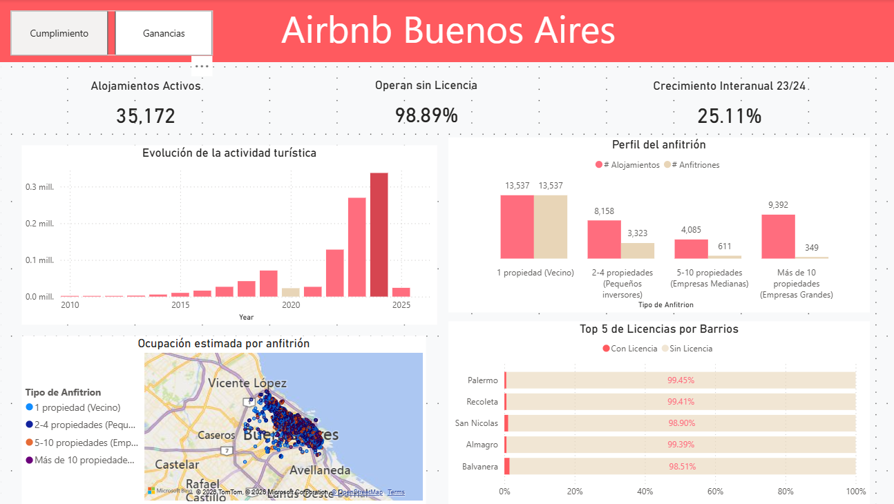
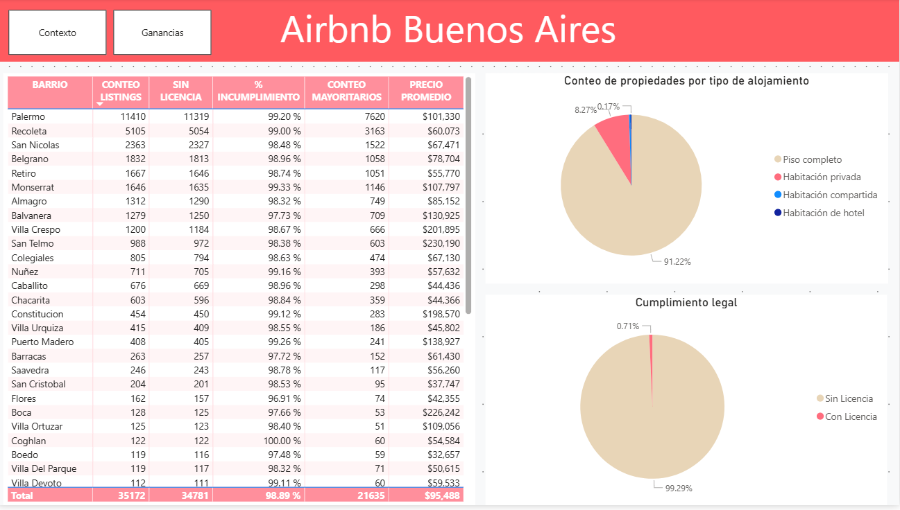

# Airbnb_BuenosAires
# Análisis del Mercado de Airbnb en Buenos Aires: Cumplimiento Legal y Perfil de Propietarios 🇦🇷

## Descripción del Proyecto
Este proyecto analiza el ecosistema de alquileres temporales en la Ciudad Autónoma de Buenos Aires (CABA) desde la perspectiva del **cumplimiento normativo municipal**. El objetivo principal fue transformar datos crudos en un dashboard interactivo que permita identificar la situación legal de cada propiedad listada en Airbnb, revelando que la **mayoría de los propietarios son empresas** y que **más del 99% opera sin la licencia requerida** para trabajar legalmente.

## Herramientas Utilizadas
* **Power BI**: Creación de dashboard interactivo y modelado de datos.
* **Power Query (M)**: Proceso de ETL (Extracción, Transformación y Carga).
* **GitHub**: Control de versiones y documentación.

## Proceso de Limpieza (ETL)
Dada la naturaleza de los datos de Airbnb (Inside Airbnb), se realizaron las siguientes tareas de limpieza para asegurar la calidad del análisis:
* **Tratamiento de nulos**: Gestión de reseñas y descripciones faltantes.
* **Normalización de precios**: Conversión de tipos de datos y limpieza de caracteres especiales ($).
* **Filtrado de Outliers**: Eliminación de registros con precios irreales para evitar sesgos en el promedio.
* **Geocodificación**: Validación de barrios y coordenadas de Buenos Aires.
* **Clasificación de propietarios**: Identificación y segmentación entre particulares y empresas/anfitriones profesionales según número de propiedades listadas.

## Visualizaciones Principales
>

1. **Mapa de Calor**: Distribución geográfica de propiedades por barrio (Palermo, Recoleta, etc.) con segmentación por estado legal.
2. **KPIs de Cumplimiento Legal**:
   - % de propiedades **sin licencia** (~99%)
   - % de propiedades **con licencia vigente**
   - Número total de propiedades analizadas
3. **Perfil de Propietarios**: Comparativa entre anfitriones particulares vs. empresas/propietarios multi-propiedad, mostrando la concentración del mercado en actores profesionales.
4. **Análisis de Tipos de Propiedad**: Distribución entre departamentos completos, habitaciones privadas y habitaciones compartidas.

## 📁 Estructura del Repositorio
* `/Data`: Contiene muestras representativas de los datasets originales (debido a restricciones de tamaño de GitHub).
* `/Images`: Capturas de pantalla del dashboard de Power BI.
* `Airbnb_BuenosAires.pbix`: Archivo principal del reporte de Power BI.
* `README.md`: Documentación del proyecto.

---
**Daniel** | *Geólogo & Aspirante a Data Scientist*
